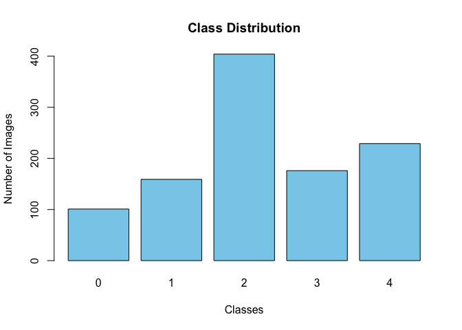
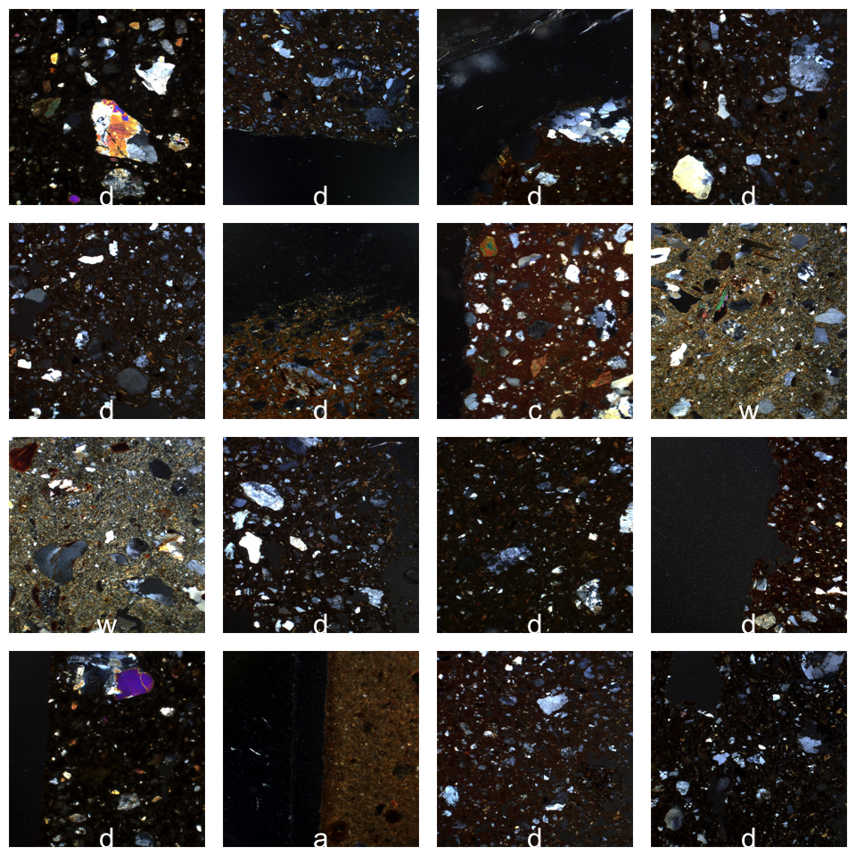
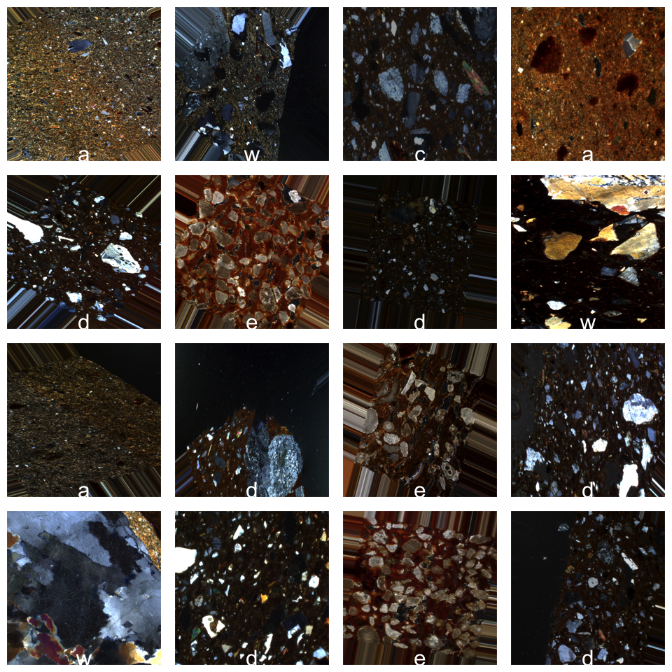

Petrographic Data Preparation and Visualization
================
Nick Gauthier
Last knit on 2023-08-15

In this notebook, we’ll go through the process of loading and
visualizing thin section image data for deep learning. The end goal is
to familiarize ourselves with some of the steps necessary to prepare
image data for neural network models.

## Setup and Install Necessary Libraries

``` r
library(tensorflow)
library(keras)
library(here)
```

The above libraries have distinct functions:

-   **`tensorflow`** allows us to interface with the TensorFlow deep
    learning framework.

-   **`keras`** provides a high-level neural networks API, written in
    Python and capable of running on top of TensorFlow. We can access it
    in R through the `reticulate` package, which translates between R
    and Python code.

-   **`here`** simplifies path management in R, ensuring robust paths
    regardless of the working directory or operating system.

Go [to this link](https:://tensorflow.rstudio.com/install/) for
instructions on how to download these packages if installing them
through R Studio the normal way doesn’t work.

## Data Loading

``` r
# Set the path for our image data
image_dir <- here('data/Lyons_data') 
```

Before we move forward, we should check if the data is already present
in our directory. If it’s not, we’ll download it from [this Dropbox
link](https://www.dropbox.com/sh/e4r2fnfq3gspytk/AACGGyuKY5xgKv3UAVWdXSG-a?dl=1).
You should end up with a folder named `data` in the same folder as this
notebook, and inside `data` there should be a folder called `Lyons_data`
that contains the image data (themselves organized into folders for each
category of ceramic).

``` r
if(!file.exists(image_dir)){
  options(timeout = 180) # Increase this "timeout" number for slower internet connections
  download.file('https://www.dropbox.com/sh/e4r2fnfq3gspytk/AACGGyuKY5xgKv3UAVWdXSG-a?dl=1',
                image_dir)
}
```

These data are kindly provided by Mike Lyon from his excellent paper
[Ceramic Fabric Classification of Petrographic Thin Sections with Deep
Learning](https://journal.caa-international.org/articles/10.5334/jcaa.75).
Check it out for more details on the dataset and archaeological context.

## **Data Generators and Augmentation**

In deep learning, especially when dealing with large datasets like
images, it’s not efficient (and sometimes not even possible) to load the
entire dataset into memory. Instead, we use **data generators**.

A **data generator** acts like a conveyor belt, supplying batches of
data to the model as needed. This ensures that only a subset of the
dataset (a batch) is loaded into memory at any given time, making it
memory-efficient.

**Batching** is the process of dividing the dataset into smaller subsets
(batches). Training on batches helps in:

1.  Memory efficiency: Not all data needs to be loaded at once.

2.  Faster convergence: Updates to the model are made after each batch.

3.  Better generalization: Noise in the data (from batch variation) can
    prevent overfitting.

Another common practice in deep learning, especially with image data, is
to artificially expand the size of the training set by applying various
transformations to the images. This can include rotation, zooming,
flipping, etc. This process is called “data augmentation”.

For now, we’ll only rescale the images so that pixel values lie between
0 and 1. For neural networks to function optimally, it’s essential to
scale or normalize these pixel values (0-255 for 8-bit images), which is
why we rescale them to the range \[0,1\] in our data generator.

``` r
datagen <- image_data_generator(rescale = 1/255.0)
```

With our **`datagen`** prepared, we can now set it up to fetch batches
of images from our directory.

``` r
generator <- flow_images_from_directory(
  image_dir,                  # Target directory  
  datagen,                    # Data generator
  target_size = c(512, 512),  # Resizes all images to 512 × 512 pixels
  batch_size = 16,            # Number of images per batch
  class_mode = "categorical"  # This is for multiclass classification
)
```

    Found 1069 images belonging to 5 classes.

## Data Exploration

Let’s fetch a single batch of images to explore its contents.

``` r
# Fetch a batch
batch <- generator_next(generator)
images <- batch[[1]]
labels <- batch[[2]]

# Display the shape/dimensions of the fetched batch
dim(images)
```

    [1]  16 512 512   3

``` r
dim(labels)
```

    [1] 16  5

Images are fundamentally numerical matrices. A grayscale image is
represented as a 2D matrix, where each entry corresponds to a pixel
value . For colored images, particularly RGB (Red, Green, Blue) images,
the representation is a 3D matrix. The third dimension corresponds to
the color channels.

If multiple images are combined in a batch, the batch index usually goes
in the first instead.

``` r
# Look at the first 4x4 pixels of the RGB channels for the 10th batch member
images[10, 1:4,1:4, 1:3]
```

    , , 1

              [,1]      [,2]      [,3]      [,4]
    [1,] 0.1803922 0.2039216 0.2078432 0.2039216
    [2,] 0.3372549 0.3215686 0.2666667 0.2392157
    [3,] 0.3176471 0.3607843 0.2980392 0.2039216
    [4,] 0.3372549 0.3294118 0.2549020 0.1843137

    , , 2

              [,1]      [,2]      [,3]      [,4]
    [1,] 0.1058824 0.1176471 0.1411765 0.1764706
    [2,] 0.2705882 0.2509804 0.2156863 0.2156863
    [3,] 0.2470588 0.3098039 0.2627451 0.1764706
    [4,] 0.2705882 0.3019608 0.2431373 0.1568628

    , , 3

               [,1]       [,2]       [,3]      [,4]
    [1,] 0.03921569 0.03529412 0.07058824 0.1137255
    [2,] 0.20784315 0.17254902 0.14901961 0.1607843
    [3,] 0.20000002 0.24313727 0.19607845 0.1372549
    [4,] 0.23137257 0.23921570 0.18431373 0.1333333

The class labels are also stored as matrix. For the image labels the
dimensions are batch size, number of categories. Let’s look at the
labels/categories of the first 4 images.

``` r
labels[1:4,]
```

         [,1] [,2] [,3] [,4] [,5]
    [1,]    0    1    0    0    0
    [2,]    0    1    0    0    0
    [3,]    0    0    0    1    0
    [4,]    0    0    0    0    1

This format is known as “one-hot encoding”. What does this mean? For a
5-class problem, instead of labels being 1, 2, or 3, they’d look like:

-   Class 1: \[1, 0, 0, 0, 0\]

-   Class 2: \[0, 1, 0, 0, 0\]

-   Class 3: \[0, 0, 1, 0, 0\]

This format is especially helpful for multi-class classification tasks
and is more compatible with how neural networks work – it’s basically a
way of using numbers to represent categories

We can also look at the distribution of each class.

``` r
# Checking distribution of classes
class_counts <- table(generator$classes)
barplot(class_counts, main="Class Distribution", xlab="Classes", ylab="Number of Images", col="skyblue")
```



Data like this with imbalanced classes can pose a problem for many
classification methods – but we’ll worry about that later.

## **Visualizing the Images**

Finally, we’ll visualize some of our images. Don’t worry too much about
the inner workings of the visualization code for now; it’s primarily a
tool to help us see our data.

``` r
# Visualization function
visualize_batch <- function(images, labels) {
  # Assuming the images are in [0, 1] scale
  num_images <- nrow(images)
  
  # Retrieve class labels
  class_names <- names(generator$class_indices)
  label_indices <- max.col(labels)  # Convert one-hot encoded labels to indices
  label_texts <- class_names[label_indices]
  
  # Adjust the margins to reduce spacing between images
  par(mfrow=c(sqrt(num_images), sqrt(num_images)), mar=c(0.1, 0.1, 0.1, 0.1), oma=c(0, 0, 0, 0))
  
  for (i in 1:num_images) {
    img <- images[i,,,]
    # Convert array to matrix (for grayscale, you might not need this)
    img <- aperm(img, c(2, 1, 3))
    plot(0:1, 0:1, type="n", ann=FALSE, axes=FALSE, asp=1) # Ensure aspect ratio is 1
    rasterImage(img, 0, 0, 1, 1)
    
    # Overlay class label
    text(0.5, 0.05, label_texts[i], col="white", cex=3, srt=0, adj=c(0.5, 0.5))
  }
}

# Visualize the batch
visualize_batch(images, labels) # Visualize the first batch of 16 images
```



Now we can try adding some more data augmentation. Feel to adjust these
numbers or comment out different lines to see the results.

``` r
datagen_augmented <- image_data_generator(
  rescale = 1/255.0,
  rotation_range = 40,
  brightness_range = c(0.5, 1.5),
  zoom_range = 0.5,
  horizontal_flip = TRUE,
  vertical_flip = TRUE,
  fill_mode = "nearest"
)

generator_augmented <- flow_images_from_directory(
  image_dir,                  
  datagen_augmented,           
  target_size = c(512, 512),  
  batch_size = 16,
  class_mode = "categorical"
)
```

    Found 1069 images belonging to 5 classes.

``` r
batch_augmented <- generator_next(generator_augmented)
images_augmented <- batch_augmented[[1]]
labels_augmented <- batch_augmented[[2]]

visualize_batch(images_augmented, labels_augmented)
```



That’s all for now!
